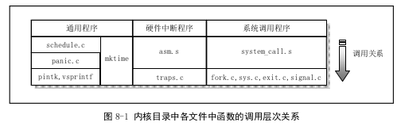

kernel/
=====

### 1.概括：

功能有三类：
+ 硬件（异常）中断处理

+ 系统调用服务处理

+ 进程调度

### 2.中断处理：

asm.s & traps.c

#### 1) asm.s
实现大部分硬件异常引起的中断的汇编语言处理过程

#### 2) traps.c
实现asm.s中断处理过程中调用的c函数

**另外一些硬件中断处理在 system_call.s 和 mm/page.s 中** 

### 3.系统调用处理相关程序

Linux中应用程序调用内核的功能是通过中断调用int0X80进行的，eax放调用号，如果有参数，放置在ebx，ecx，edx。被称为系统调用。

system_call.s fork.c signal.c sys.c exit.c

#### 1) system_call.s
类似硬件中断处理中的asm.s的作用，另外还对时钟中断和硬盘，软盘中断进行处理。
#### 2) fork.c & signal.c
类似traps.c的作用，为系统中断提供C处理函数
**fork.c**: 提供两个C处理函数：find_empty_process(), copy_process()
**signal.c**: 提供一个处理有关进程信号的函数do_signal()，在系统调用中断处理的过程中被调用
还有4个系统调用sys_xxx()函数

#### 3) sys.c & exit.c
实现了其他一些sys_xxx()系统调用函数。这些函数都是相应系统调用所需要的处理函数，有些是用汇编写的，如sys_execve();其他是用C实现的（如signal.c中的4个系统调用函数）

**规则**：
    + 以‘do_’开头的中断处理和过程中调用的C函数，要么是系统调用处理过程中通用的函数，要么是某个系统调用专有的;
    + 以‘sys_’开头的系统调用函数则是指定的系统调用的专用处理函数
    
如：do_signal()函数基本上是所有系统调用都要执行的函数，而sys_pause(),sys_execve()则是某个系统调用专有2的C处理函数

### 4.其他通用类程序
schedule.c mktime.c panic.c printk.c vsprintf.c

#### 1) schedule.c
包括内核调用最频繁的schedule(),sleep_on(),wakeup()

#### 2) mktime.c
包含一个内核使用的时间函数mktime(),仅在init/main.c中被调用一次。

#### 3) panic.c
包含一个panic()函数，用于内核运行出现错误时显示出错信息并停机

#### 4) printk.c & vsprintf.c
内核显示信息的支持程序，实现内核专用显示函数prinkt()和字符串格式化输出函数vsprintf()

